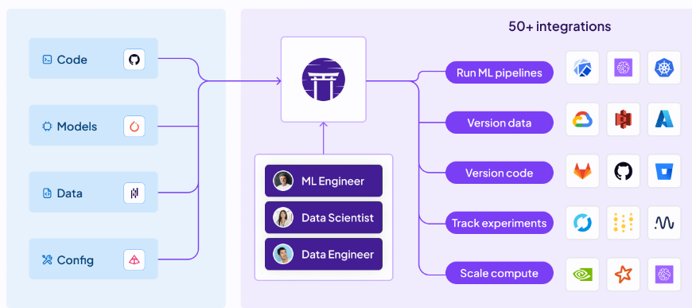

# End to end project using ZenML

"**ZenML** is an extensible, open-source MLOps framework for creating portable, production-ready machine learning pipelines."

"ZenML is a MLOps framework intended for data scientists or ML engineers looking to standardize machine learning practices. Just add `@step` and `@pipeline` to your existing Python functions to get going."

After adding the simple decorators when the code is run ZenML will automatically keep track of your models, pipelines and artifacts. You can also seamlessly integrate other frameworks for model tracking like MLFlow. It provides a UI to visualize all your runs information.

"ZenML pipelines can be run on AWS, GCP, Azure, Airflow, Kubeflow and even on Kubernetes without having to change any code or know underlying internals."

ZenML also allows you to deploy your models using for example MLFlow, Seldon, BentoML, Hugging Face, etc...

Check https://github.com/zenml-io/zenml and https://docs.zenml.io/ for more information.

This repo is an example template for future ML projects produced by experimenting with ZenML.

